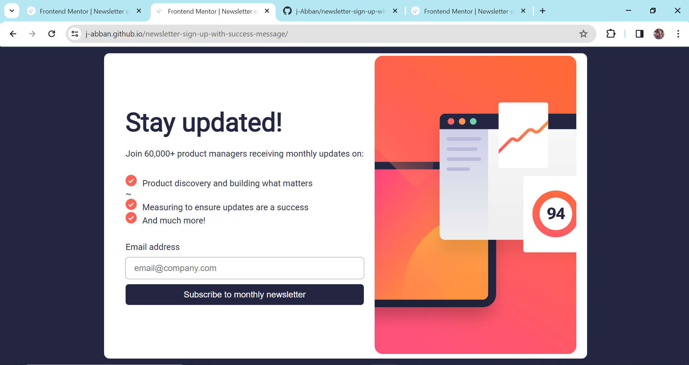

# Frontend Mentor - Newsletter sign-up form with success message solution

This is a solution to the [Newsletter sign-up form with success message challenge on Frontend Mentor](https://www.frontendmentor.io/challenges/newsletter-signup-form-with-success-message-3FC1AZbNrv). Frontend Mentor challenges help you improve your coding skills by building realistic projects.

## Overview

### The challenge

Users should be able to:💻

- Add their email and submit the form
- See a success message with their email after successfully submitting the form
- See form validation messages if:
- The field is left empty
- The email address is not formatted correctly
- View the optimal layout for the interface depending on their device's screen size
- See hover and focus states for all interactive elements on the page

### Screenshot📸

### Links👇

- Solution URL: https: https://github.com/j-Abban/newsletter-sign-up-with-success-message
- Live Site URL: https://j-abban.github.io/newsletter-sign-up-with-success-message/

## My process

### Built with👷🔨🔩🛠

- Semantic HTML5 markup: Ensured the structure of the page is meaningful and accessible.
- CSS custom properties: Utilized variables for easier styling adjustments.
- Flexbox: Employed for layout and alignment of elements.
- CSS Grid: Used for organizing the layout of specific components.
- Mobile-first workflow: Designed and developed the project with a focus on mobile responsiveness.
- React: Used React library for building interactive components and managing state.
- Styled Components: Implemented styled components for modular and maintainable styling.

### What I learned 👨‍💻📚

- During this project, I reinforced my knowledge in semantic HTML, CSS, and responsive design techniques. Additionally, I gained experience in integrating form validation and displaying success messages dynamically using JavaScript.
- Form validation: Learned how to implement client-side form validation using JavaScript.
- Dynamic rendering: Explored techniques for dynamically rendering success messages based on user input.
- Responsive design: Improved understanding of creating responsive layouts to ensure compatibility across different devices.
- Component-based architecture: Deepened understanding of component-based architecture and its benefits for code organization and reusability.

### Continued development

In future projects, I aim to further enhance my skills in JavaScript.

### Useful resources
- MDN Web Docs: Comprehensive resource for HTML, CSS, and JavaScript documentation.
- React Documentation: Official documentation for the React library, providing in-depth guides and tutorials.
- Frontend Mentor: Platform offering realistic coding challenges and supportive community for frontend developers.
- Styled Components Documentation: Official documentation for Styled Components library, containing guides and examples for usage.
- https://www.chatgpt.com - This helped me to figure out the errors I faced.🤣 I really liked this pattern and will use it going forward.

## Author👨‍💻
- Justice Abban 
- QA Engineer👷
- Twitter - [@kwam3_abban](https://www.twitter.com/@kwam3_abban)

## Acknowledgments

- I would like to acknowledge the helpful resources provided by Frontend Mentor and the supportive community on various forums.
- I would like to also appreciate my:
- QA Mentor: Mr. Francis Asante Nsiah👨🏿
- Senior Trainer @amalitech 